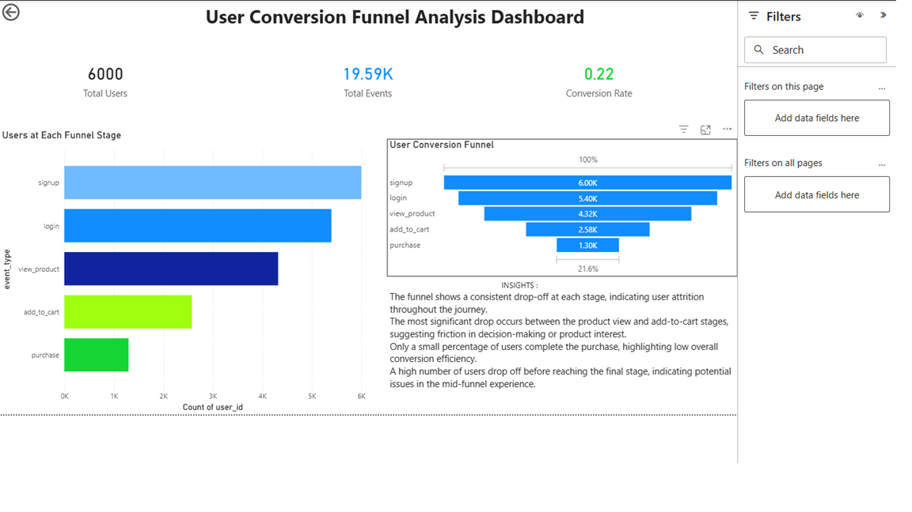

# Product Analytics Funnel Analysis

---

## Project Overview

This project focuses on analyzing user behavior through a structured conversion funnel to understand how users move from signup to purchase.

The goal is to identify drop-off points, measure conversion efficiency, and provide actionable insights to improve product performance.

---

## Business Problem

Many users sign up for a product but do not complete the purchase journey.

This project answers:

* How many users progress through each stage of the funnel?
* Where do users drop off?
* What is the overall conversion rate?
* Which stage needs optimization?

---

## Dataset Description

### 🧾 Users Table

* `user_id` — Unique identifier
* `signup_date` — Date of signup
* `country` — User location

### 📌 Events Table

* `user_id` — User identifier
* `event_type` — Funnel stage (signup, login, view_product, add_to_cart, purchase)
* `event_date` — Date of event

---

##  Key Insights

* A consistent drop-off is observed at each stage of the funnel.
* The most significant drop occurs between the product view and add-to-cart stages.
* Only a small percentage of users complete the purchase journey.
* Mid-funnel optimization presents the biggest opportunity for improving conversions.

---

## 📊 Dashboard Features

* KPI metrics: Total Users, Total Events, Conversion Rate
* Funnel visualization of user journey
* Stage-wise user comparison
* Clean and intuitive layout for quick decision-making

---

## 🛠 Tools & Technologies

* SQL (Data analysis & querying)
* Power BI (Dashboard & visualization)

---

##  Project Structure

Product-Analytics-Funnel-Analysis/
│
├── data/
│   ├── product_users_clean.csv
│   └── product_events_clean.csv
│
├── sql/
│   └── product_user_behavior_analysis.sql
│
├── dashboard/
│   └── dashboard.png
│
└── README.md

---

## Dashboard Preview

---

## 💼 Skills Demonstrated

* Data analysis using SQL
* Funnel analysis and conversion tracking
* Data visualization with Power BI
* Business problem solving
* Insight generation and storytelling

---

## 🚀 Conclusion

This project demonstrates how data-driven analysis can identify bottlenecks in user conversion and help improve product performance through targeted optimizations.
